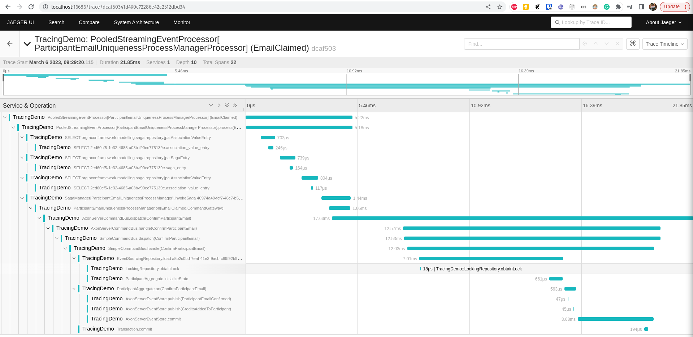
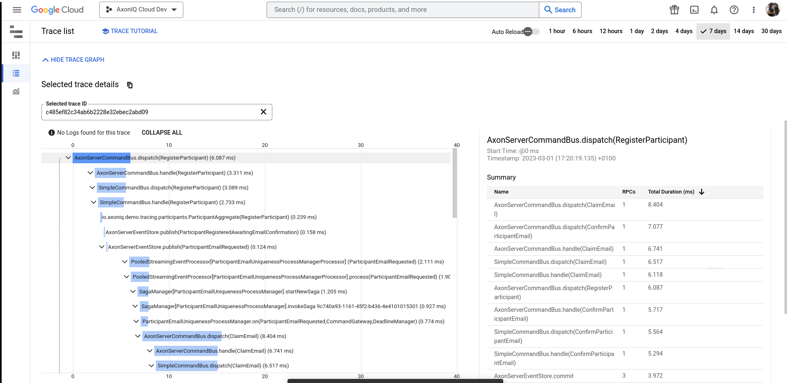

# OpenTelemetry Axon Framework demo

This demo repository contains an application with the configuration setups necessary to deal with various OpenTelemetry
providers.

## Demo setup

The demo application registers a participant every 10 seconds and will use a Saga to guarantee the uniqueness of the
email.
It will go wrong on purpose sometimes, to give variance in traces.

The events produced are put into a projection, which emits query updates for active subscription queries.
All types of queries are included for tracing: Direct queries, Scatter-Gather queries, Streaming queries and
Subscription queries are all done every 5 seconds.

## How to run

The project contains various run configuration for IntelliJ. You can, of course, also run them manually.

The demo uses Axon Server. To run an Axon server locally, start it with Docker:

```shell
docker run -d --name axonserver-tracing-demo -p 8024:8024 -p 8124:8124 axoniq/axonserver
```

### Agent Local Jaeger (Nested) Demo

This configuration runs this demo with a local Jaeger all-in-one instance. There is no Java configuration required
because the
OpenTelemetry auto-instrumentation does everything out of the box. You only need to run Jaeger locally:

```shell
docker run --name jaeger \
  -e COLLECTOR_OTLP_ENABLED=true \
  -p 16686:16686 \
  -p 4317:4317 \
  -p 4318:4318 \
  jaegertracing/all-in-one:1.35
```

The demo works by setting the environment variables before running the `core` module:

```shell
wget https://github.com/open-telemetry/opentelemetry-java-instrumentation/releases/download/v1.23.0/opentelemetry-javaagent.jar
mvn clean install
export OTEL_EXPORTER_OTLP_ENDPOINT=http://127.0.0.1:4317
export OTEL_SERVICE_NAME=TracingDemo
export OTEL_TRACES_EXPORTER=otlp
java -javaagent:opentelemetry-javaagent-1.23.jar -Dio.opentelemetry.context.enableStrictContext=true -Dspring.profiles.active=nested -jar core/target/core-0.0.1-SNAPSHOT.jar
```

Now you can access Jaeger on http://localhost:16686/



Note that, due to the OpenTelemetry auto-instrumentation, Spring Boot and datasources are instrumented and visible as
well.

### Google Trace demo

Google Trace does not work well with the auto-instrumentation agent. Please do not use the agent when using Google
Trace.
Instead, use configuration like shown in the `google-trace` module.

To run the demo manually, run:

```shell
mvn clean install
java -javaagent:opentelemetry-javaagent-1.23.jar -Dio.opentelemetry.context.enableStrictContext=true -Dspring.profiles.active=nested -jar google-trace/target/core-0.0.1-SNAPSHOT.jar
```

You need the Google cloud SDK locally with a project configured. Now you can access the tracing in the Google cloud
console:



## Other providers

We want to include any provider in here that is not possible to use using auto-instrumentation only, such as Google
Trace. If you happen
to stumble on such a provider, please let us know (perhaps with the correct configuration to make the demo work with).
